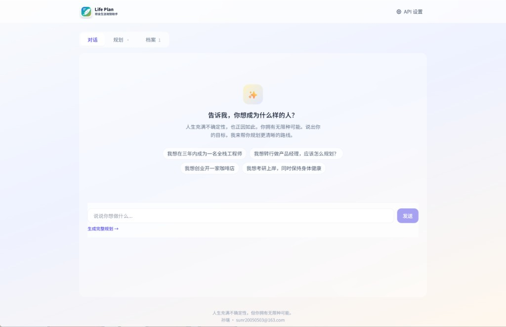
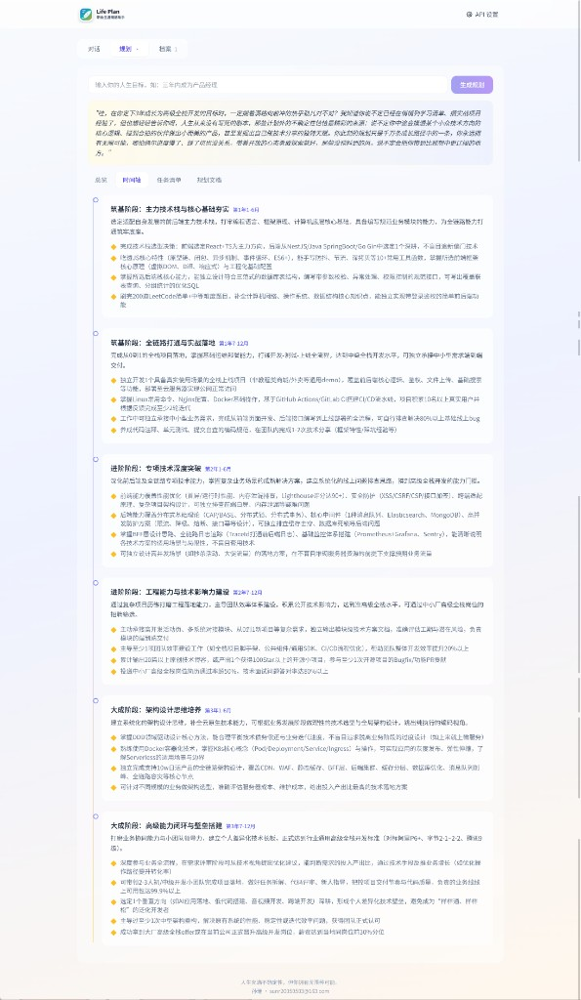
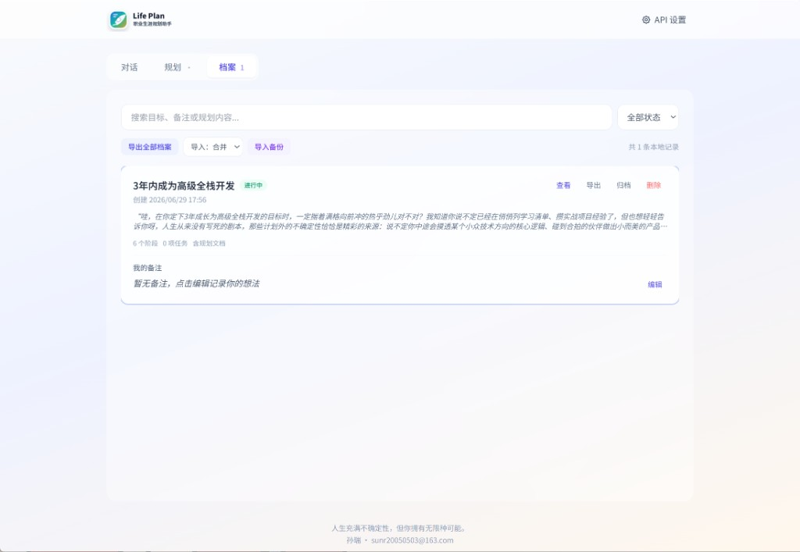

# Life Plan

> *Life does not arrive with a map. It unfolds like morning light—uncertain, unrepeatable, and brimming with paths you have not yet imagined.*

**Life Plan** is a pure-frontend companion for the quietly ambitious soul. Tell it what you wish to become, and a chorus of AI agents will help you chart a route—not as prophecy, but as poetry: a living draft of who you might be, written in timelines, tasks, and words you can carry forward.

Every conversation remembers what matters most: **life is uncertain, and that is not a flaw—it is the door to infinite possibility.**

Built on the [Volcengine Ark Doubao Chat API](https://www.volcengine.com/docs/82379/1399008?lang=zh).

---

## Author

| | |
|---|---|
| **Creator** | Sun Rui (孙瑞) |
| **Website** | [www.ddup.pro](https://www.ddup.pro) |
| **Email** | [sunr20050503@163.com](mailto:sunr20050503@163.com) |

---

## What It Offers

- **API Configuration** — Store your Doubao API Key, Model ID, or Endpoint ID locally
- **Streaming Dialogue** — Conversations that weave warmth, wonder, and the reminder that your story is still being written
- **Multi-Agent Planning** — Five minds, one intention:
  - *The Keeper of Beginnings* — an opening word of courage
  - *The Pathfinder* — your best route forward
  - *The Chronologist* — phases etched across time
  - *The Task Weaver* — steps you can actually take
  - *The Scribe* — a full planning document, ready to export
- **Export** — Markdown and PDF, for the plan you want to keep
- **Local Records** — Browse, search, annotate, archive, and back up career plans in browser storage
- **Responsive Design** — equally at home on phone and desktop

---

## Screenshots

### Chat — speak your ambition



Start with a goal, explore suggested prompts, and let the assistant guide you toward a fuller plan.

### Plan — timeline across years



Multi-agent output becomes a phased roadmap with milestones, tasks, and exportable documents.

### Records — local career archive



Every plan is saved locally. Search, annotate, export, import, and revisit your journey anytime.

---

## Quick Start

### Requirements

- Node.js 18+
- npm, pnpm, or yarn

### Install & Run

```bash
git clone <your-repo-url>
cd Life-plan

npm install
npm run dev      # development
npm run build    # production build
npm run preview  # preview build
```

### API Setup

1. Sign in to the [Volcengine Ark Console](https://console.volcengine.com/ark)
2. Activate a Doubao model in the [Model Hub](https://console.volcengine.com/ark/region:ark+cn-beijing/openManagement)
3. Create an endpoint in [Inference Endpoints](https://console.volcengine.com/ark/region:ark+cn-beijing/endpoint) *(recommended)*
4. Generate an API Key in [API Key Management](https://console.volcengine.com/ark/region:ark+cn-beijing/apiKey)
5. Enter your credentials in **API Settings** (top-right of the app)

> Keys are stored in browser `localStorage`. Do not use on shared devices.  
> See [docs/api-setup.md](./docs/api-setup.md) for details.

---

## Project Structure

```
├── docs/                 # Documentation
│   └── screenshots/      # README preview images
├── public/               # Static assets
├── src/
│   ├── agents/           # Multi-agent prompts & orchestration
│   ├── components/       # Vue components
│   ├── composables/      # Composable logic
│   ├── services/         # API, storage, export
│   └── types/            # TypeScript types
├── index.html
├── package.json
└── vite.config.ts
```

---

## Tech Stack

- Vue 3 + TypeScript + Vite
- Tailwind CSS 3
- Doubao Chat Completions API (OpenAI-compatible)
- marked · jsPDF · html2canvas

---

## Documentation

- [API Setup Guide](./docs/api-setup.md)
- [Development Guide](./docs/development.md)

---

## References

- [Chat API](https://www.volcengine.com/docs/82379/1399008?lang=zh)
- [Bot API](https://www.volcengine.com/docs/82379/1756990?lang=zh)
- [Volcengine Ark Console](https://console.volcengine.com/ark)

---

## License

[MIT License](./LICENSE)

---

## Contact

Questions, thoughts, or a story to share:

**Sun Rui** · [www.ddup.pro](https://www.ddup.pro) · [sunr20050503@163.com](mailto:sunr20050503@163.com)
